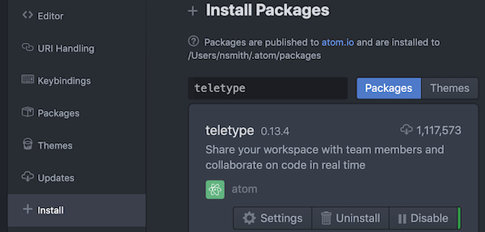

We'll use three categories of software.  You can participate at any level your software allows.  Please try the tests for each level, and complete the online registration form.

## 1. Consultant

Consultants can read manuscripts online and take part in the team’s video chats. Requirements: a device (computer, tablet, phone) with internet access and:

- a web browser. **Test**: to test your browser, browse, zoom, and pan this [page of the Venetus A manuscript of the *Iliad*](http://www.homermultitext.org/ict2/)
- video conferencing software. Beginning in summer 2020, we’re using [Zoom](https://zoom.us/). **Test**:  (join this test meeting)[https://zoom.us/test]

## 2. Editor

Editors can do everything consultants can do, plus they can directly edit the team’s XML documents and structured text files. Requirements: in addition to the requirements for consultants, editors need:

- a computer with the Atom editor, and the teletype plugin.  You can [download Atom here](https://atom.io/). One way to install the teletype plug is to choose "Preferences" from the Atom menu, then, from the "Install" type, find teletype.  You'll see something similar to this.

**Test**: when you open Atom, you should find an icon like the one marked here at the bottom of your Atom window, and be able to open a menu as illustrated here by clicking on it.

## 3. Session host

Session hosts manage the team’s github repository, and run validation scripts to check the team’s editorial work. Requirements: in addition to the requirements for editors, session hosts need:

- a working [account on github](https://github.com/). **Test**: you know your github password and can actually login!
- a bash shell and git. For Windows 10, see [how to install both at once](http://www.homermultitext.org/editors/technologies/install-bash/). For Mac OS X, you already have a bash shell (`Terminal.app` in the Utilities folder inside your Applications folder).  See [how to install `git` on OS X](https://www.atlassian.com/git/tutorials/install-git).  **Test**: you can open a bash shell, type `which git`, and see some result.
- a working [account on dockerhub](https://hub.docker.com/). **Test**: you know your dockerhub password and can actually login!
- either [Docker Desktop (OS X users)](https://docs.docker.com/docker-for-mac/install/) or [Docker Toolbox (Windows users)](https://docs.docker.com/toolbox/toolbox_install_windows/). **Test**: open a bash shell (OS X users) or a Docker shell (Windows users) and type `docker run hello-world`. You should see docker download a Docker image and run a Docker container that (eventually) writes some output to your terminal.
