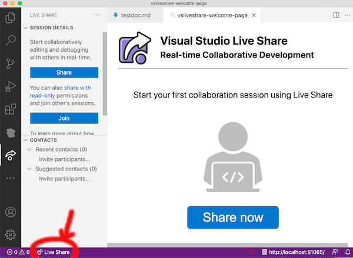

# Live Share extension

## What it does

The "Live Share" extension allows us to edit colaborate in an editing session over the internet.  It might feel a little like a shared Google Doc, but instead of sharing one document, Live Share lets us share the entire editing session, so team members can work together on all the documents we create in editing a manuscript.

## Install and configure

- From the exension mode in VS Code ("puzzle pieces" icon), install the "Live Share" extension

> ## **⚠️** Warning
> You may see a welcome message like this when you install Live Share.  
>> We recommend that you **do not choose the "Share now" option**.  
>
> In our first zoom session, we will learn how to share an editing session using your github ID to authenticate to Live Share.  Before we can do that, you will need to [establish a github account](../../github/).
>
> 

## Test your installation of Live Share

In the ribbon at the bottom of your VS Code window, you should see a "Live Share" label (red arrow in the illustration above).  If you do, you have correctly installed the Live Share extension.

