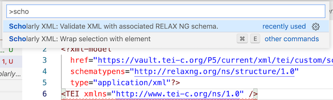
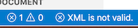

# Scholarly XML extension


## What it does

We encode our editions of texts in the eXentsible Markup Language (XML).  We use the Scholarly XML extension in VS Code to validate your XML against the standards of the Text Encoding Initiative (TEI).


## Install

- From the exension mode in VS Code ("puzzle pieces" icon), install the Scholarly XML extension

No additional configuration is necessary.

## Testing your installation of Scholarly XML


Create a test document: 

1. Create a new document in VS Code.  Save it with a filename ending in `.xml`
2. Paste the following text into your document and save it.

```
<?xml version="1.0" encoding="UTF-8"?>
<?xml-model
  href="https://vault.tei-c.org/P5/current/xml/tei/custom/schema/relaxng/tei_all.rng"
  schematypens="http://relaxng.org/ns/structure/1.0"
  type="application/xml"?>
<TEI xmlns="http://www.tei-c.org/ns/1.0" />
```

Validate your test document:

1. From the `View` menu, choose `Command Palette` (or use the shortcut command-shift-P).
2. Start typing "Scholarly XML" until you see a menu option to `validate XML with associated RELAX NG schema`





After you choose that option, check the bottom of your editing window.  You should see an indication that you have an error, like this.


