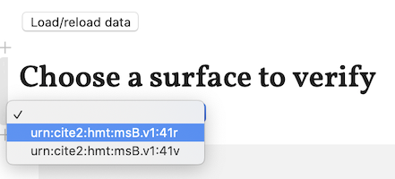

# Validating your work

The session host is responsible for validating the team's work. While loading and initially building the Pluto notebook is slow, when you update your data, your validation results update nearly instantly.

## Validating a page

The validation looks at all material for a single page of your manuscript.  In your notebook, find the pop-up menu labeled "Choose a surface to verify".  It shows you the URNs for every page in this repository with edited material.  In the example illustrated here, the repository has material for pages 41r and 41v of the Venetus B manuscript, and the user is about to select to validate 41r.

When you select a page, the notebook immediately collects and evaluates your tabular indexing and XML editions.

> ## ❗️Nota Bene
>
> The basic MID validator notebook will always include sections validating and verifying your DSE indexing of text to image, the correspondences between your text editions and your indexing, and the orthography of your XML editions.
>
> In addition, newer forms of HMT-specific validation may also be added. See separate documentation for the most up-to-date information on your validating notebook.

## Reloading your data

When some section of your work on a page is completely valid, and you have edited further material, you can easily revalidate a page.

Just above the "Choose a surface to label" heading, you'll see button labelled `Load/reload data`.  This will reread all the data in your repository, and will set the selection of surface to validate to none.  Choose a new page to validate, or choose the same page again to revalidate it with new data (whether corrections or additional content.)

> ## ⭐️ Tips
>
> 1. Keep your indexing and editing in sync.  It will be *much* easier to track down and fix any problems this way.
> 2. Validate frequently.  It's easy to reload data and instantly see new results in your validating notebook.

