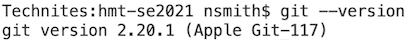
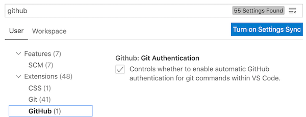

# The `git` version control system

## What it does

`git` keeps track of changes that editors make on collaborative projects.  This *version control* makes it possible for contributors to work on a project anywhere from any location without overwriting other contributors' work.

## Install and configure `git`

### Do this first

- [create an account on github](../github/)
- [install VS Code](../vscode/)

### Download and install

First, see if you already have `git` on your system.

- In VS Code, from the Terminal menu, choose `New Terminal`.  A new frame will open; at its prompt, enter `git --version`. If you see an answer reporting a version of git, then it's already installed. You can proceed to configuring your setup.    Your session might look something like this.  
- If you see a message like "not found", then [download and install git for your operating system](https://git-scm.com/downloads/)

### Configure `git` for use on github

At the terminal prompt in VS Code, run the following two commands.  Include the quotation marks, but replace `YOUR REAL NAME` and `EMAIL YOU USED FOR GITHUB` with your name and email.

    git config --global user.name "YOUR REAL NAME"
    git config --global user.email "EMAIL YOU USED FOR GITHUB"

## Test your installation of `git`

In VS Code, open the `Preferences/Settings` menu (under `Code` on OS X, or `File` on Windows).  (You can also do this by typing command+`,`.)

Search for "github," and make sure that the box for `Github Authentication` is checked.  You should be good to go!

