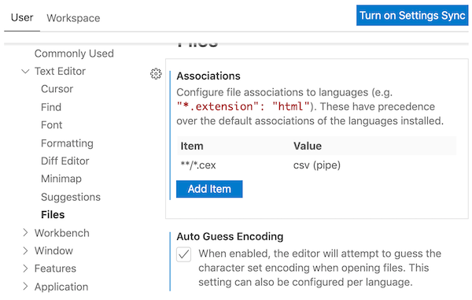
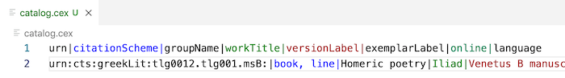
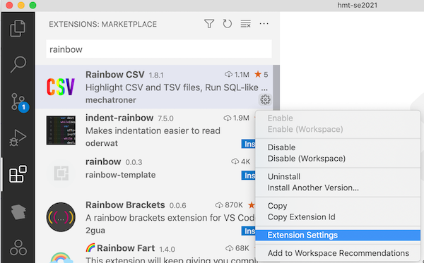

# Rainbow CSV extension

## What it does

We record tables of information in simple structured text files.  The Rainbow CSV extension in VS Code visually highlights rows and columns, and supports treating the text files as a database you can query.

## Install

- From the extension mode in VS Code ("puzzle pieces" icon), install the Rainbow CSV extension


## Configure

In VS Code, open the `Preferences/Settings` menu (under `Code` on OS X, or `File` on Windows).  (You can also do this by typing command+`,`.) Open the `Text Editor` list, and select `Files`.   Under `Files`, look for the configuration settings labelled `Associations`.



Click the `Add item` button, and fill in the form (as illustrated above) with key `**/*.cex` and value `csv (pipe)`.  (Be careful to use all lower case and include the parentheses.)  Click `OK` to save this configuration.


## Test your installation of Rainbow CSV

In VS Code, create a new file, and paste in the following contents.  This catalogs information about the *Iliad* text in the Venetus B manuscript.  In this plain-text format, columns are separated by the pipe character `|`.

```
urn|citationScheme|groupName|workTitle|versionLabel|exemplarLabel|online|language
urn:cts:greekLit:tlg0012.tlg001.msB:|book, line|Homeric poetry|Iliad|Venetus B manuscript||true|grc
```

Save the file as `catalog.cex`.  Corresponding columns should be displayed in the same color in each row, like this:




> ### ❗️ Nota Bene
>
> Your colors may differ from the illustration:  you can configure many aspects of the Rainbow CSV plugin.
> Find Rainbow CSV in VS Code's extensions mode, and use the gear icon (lower right of the VS Code tab) to explore the options.
> 
> 


<style>
    blockquote {
         
     background-color: #f0f7fb;
     background-position: 9px 0px;
     background-repeat: no-repeat;
     border-left: solid 4px #3498db;
     line-height: 18px;
     overflow: hidden;
     padding: 15px 60px;
   font-style: normal;
  
    }
</style>