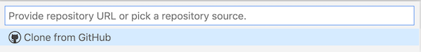
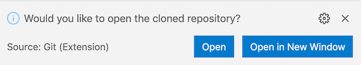

# Cloning your repository

1. Copy the URL for your repository to your clipboard.
2. In VS Code, from the `View` menu, choose `Command Palette` (or use the shortcut command-shift-P). Begin typing `Git: Clone` and enter.  When you're prompted with a message like this, paste in the repository's URL.  
3. In the following dialog box, select someplace convenient to clone the repository - perhaps your Desktop. Don't worry about cluttering your Desktop:  we'll throw the clone away at the end of the work session.
4. You'll have to confirm that you really want to do this: choose `Open` (not `Open in New Window`).  

## Note where you cloned the repository

You'll need to be able to open your repository's validating notebook from a web browser, so note where you saved the clone.

> ## ⭐️ Tip
>
> If you're not sure where in your file system you saved the clone, open a terminal in VS Code. (`Terminal` menu, `New Terminal`.)  
>
> If you're using Windows Power Shell, you'll probably see a prompt that lists the path to the repository.  If you're using bash or another shell in OS X, type `pwd` at the prompt.
>
> You can copy the full path to your clipboard before before you open your Pluto notebook.

