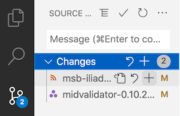
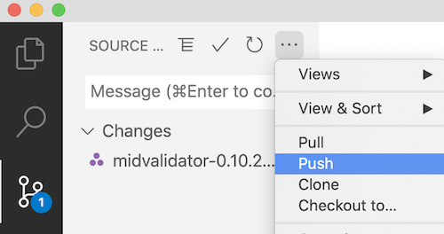

# Committing your work

The session host is responsible for keeping the team's work up to date on github.  You should push your work to github whenever you sucessfully validate a section of work.

The three steps to push your work to github are:

1. *stage* (or *add*) files to the list to commit
2. *commit* the files (with a good descriptive message)
3. *push* the files to github

This is very easy to do in VS Code.

## 1. Stage (add) files to commit

First, select the "Source control" icon from the vertical column of icons on the left side of VS Code. It looks like a kind of network graph, and has a blue circle showing the number of files modified in your repository. In this illustration there are two modified files.
They are individually listed under the head "Changes", and include a file with a name beginning `msb-iliad...` and the validating notebook, with a name beginning `midvalidator-0.10.1...`.

You should *not* add the validating notebook: only your editing work.  You *stage* or *add* it by clicking the plus sign next to the file's name (highlighted here in light gray).

> ## ⚠️ Don't commit your validating notebook!
>
> As you work with your validating notebook, it will show up as modified. You should not push those modifications to github.
>
> If you think about that, you should see why in the course of your HMT editing session, when you have pushed all of your work up to github, you will want to have the source control icon in VS Code show **1** modified file:  your notebook.

## 2. Commit

When you have staged a file, it moves out of the list of "Changes" and onto the list of "Staged Changes".  Type a message in the message box (here, "Fixed typo."), and click the checkmark at the top of of the panel (here highlighted in light gray).

## 3. Push

Your file no longer appears in the list of "Staged Changes": it's now been committed.  To push your commits to github, use the ellipsis menu just to the right of the checkmark you used to commit the files, and select "Push".

You're done!

