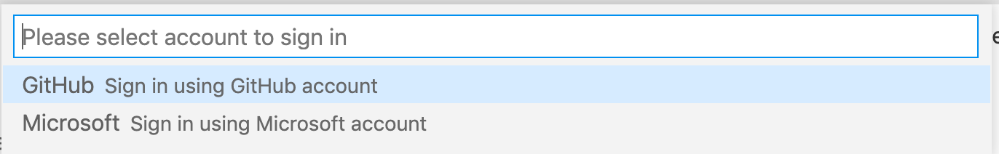
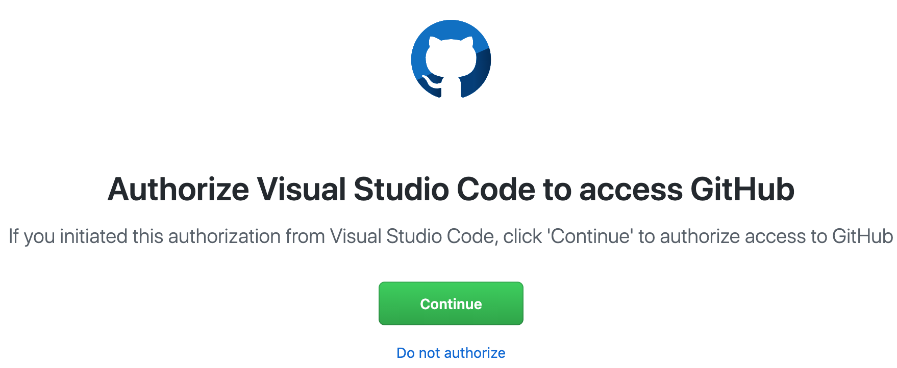

## Host shares an editing session

1. The host uses the Live Share button (in the ribbon at the bottom of the VS Code window) to start a Live Share session.  
2. At the top of VS Code window, the command palette will prompt you to authenticate.  Choose `Sign in using GitHub account`  
3. VS Code will open a web page where you can authenticate with your Github user name and password.  Choose `Continue` when you see a screen like this.  
4. The session host should send a Live Share invitation to the rest of the team.

