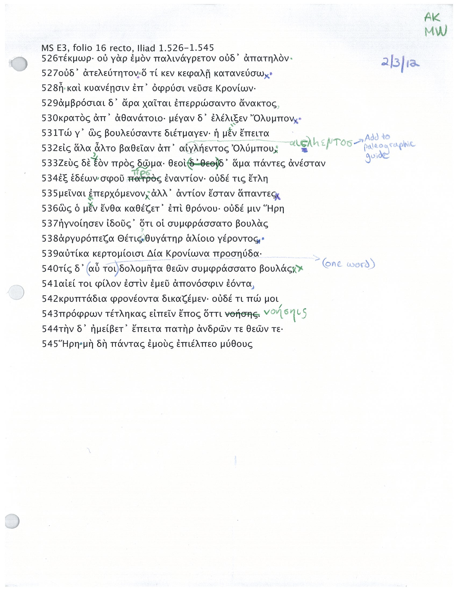

# Editing a hard copy of the *Iliad* #

Before we edit a digital version of the text, we compare the Venetus A to a print edition.  We keep the marked-up printout  to document this stage of our work, and use it as the base for a second editorial pass over the text.

1. All work should be down in groups of at least two or more. One person should have the hardcopy text; the other team members should have the folio displayed on the computer screen. Zoom in and out as necessary.

2. Slowly go through each line of the text, reading out loud and noting all accents, breathings, and punctuation. These are some of the most likely changes you will encounter.

3. Note all deviations from your printed text in colored pencil. Cross out anything that is not present in the manuscript and add anything that is missing in the print text. (See the illustration below.) Remember, you are making a diplomatic edition, not a critical edition, so you must not correct any “mistakes” by the scribe.

4. Other things you may find in the main text are abbreviations. Be sure to note where you see abbreviations. As the editorial guide explains,  you will mark some of them in the xml edition of the text, while others will be treated simply as variant letter forms. If you see an unfamiliar symbol or a word that is missing letters, you may have an abbreviation. 

5. When you are finished reading through and marking up the text, note the date and the initials of all group members on the page.  At this stage, your page may look like the illustration below.

6. When going through and editing the xml version of the text, the group will have the manuscript up again for a second reading on one computer, the hard copy edit, and the xml edition of the text on a second computer. The group that does the xml edit of the main text will again initial and date the hard copy page for that folio.

